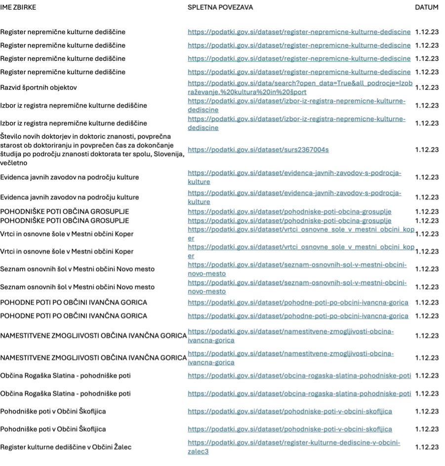
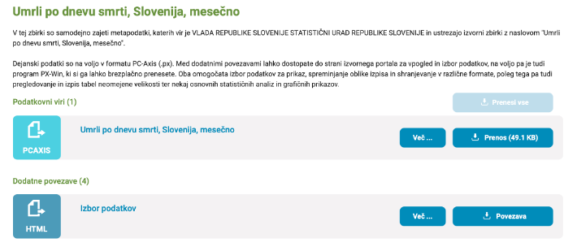

# Metodologija za kvalitativno vrednotenje odprtih podatkov

Jure Juvan1, Klara Žnideršič1, Matija Marolt1, Matevž Pesek1

1 Univerza v Ljubljani, Fakulteta za računalništvo in informatiko,
Ljubljana, Slovenija

<matevz.pesek@fri.uni-lj.si>, <jure.juvan@fri.uni-lj.si>,
<klara.znidersic@fri.uni-lj.si>, <matija.marolt@fri.uni-lj.si>

**Izvleček.** Glede na hitro naraščajočo količino odprtih podatkov in
dejstvo, da so ti široko dostopni, je pomembno, da so podatki ne le
dostopni, temveč tudi dosegajo primerno kakovost za nadaljnjo uporabo.
Ta je namreč ključna za zagotavljanje pravilnih, uporabnih in
zanesljivih rezultatov, zato je pred ponovno uporabo smiselno oceniti, v
kakšnem stanju so podatki. V ta namen smo razvili metodologijo za
kvalitativno vrednotenje odprtih podatkov, pri čemer smo elemente
metodologije izbrali na podlagi pregleda obstoječih raziskav in
pristopov k vrednotenju kakovosti podatkov. Pristop, ki ga predlagamo,
ni specifično prilagojen posameznim strokovnim področjem, temveč
vključuje splošne kazalnike kakovosti, ki omogočajo široko uporabnost
metodologije. V okviru ciljnega raziskovalnega projekta smo metodologijo
prilagodili uporabi na portalu Odprtih podatkov Slovenije (OPSI), s
čimer želimo spodbuditi uporabo slovenskih odprtih podatkov v različnih
raziskovalnih in poslovnih področjih.

**Ključne besede:** odprti podatki, kakovost podatkov, podatkovne
zbirke, metodologija, kvalitativno vrednotenje.

## Uvod

Pojem odprti podatki predstavlja vse podatke, do katerih lahko vsakdo
dostopa, jih uporablja, spreminja ali deli za katerikoli namen. Zaradi
razpršenosti podatkov se pojavljajo težave pri njihovem kvalitativnem
vrednotenju in ponovni uporabljivosti (Vetrò idr., 2016). Večina
raziskav se osredotoča na metapodatke, saj je to področje
standardizirano z uporabo RDF slovarjev in različnih lestvic kriterijev,
po drugi strani pa so raziskave na polju podatkov samih bistveno manj
raziskane zaradi raznolikosti v njihovi vsebini in vsebini podatkovnih
zbirk. Problematike nastajajo zaradi pomanjkljivih, nenatančnih,
nepopolnih, zastarelih, neunikatnih in neveljavnih podatkov, nejasnih
vrednosti, prevelike količine informacij za procesiranje, manjka
bistvenih podatkov, nesmiselnosti, nekonsistentnosti, nestrukturiranosti
in povezljivosti oziroma uparljivosti podatkovnih zbirk ter njenih
podatkov. Nekatere izmed problematik pa so bolj tehnične narave, kot so
neustrezno opredeljeni ali težko dostopni formati, odsotnost standardov
in standardne programske opreme za obdelavo odprtih podatkov ter
razdrobljenost programske opreme in aplikacij. Ker je večina metodologij
iz pregleda literature usmerjena zgolj v formate, je vsebina prepuščena
uporabniku, hkrati pa je med seboj težko primerljiva zaradi raznolikosti
v modalnosti in uporabljenih tipih.

V študiji Braunschweig idr. (2012) so ugotovili, da problemi z odprtimi
podatki nastajajo že ob dejstvu, da so ti raziskani zgolj na specifičnih
primerih, zato problem posledično terja celostno študijo o odprtih
podatkih nasploh. Analiza v študiji je pokazala, da večina petdesetih
obravnavanih spletnih portalov nima ustreznih standardov in vmesnikov
uporabniškega programa (API), pri čemer njihovi odprti podatki niso
strojno berljivi ali v ustreznem formatu. To dejstvo vztrajno preprečuje
ponovno uporabljivost in možnost uporabe avtomatiziranih orodij, kar v
praksi pomeni, da mnoge odprte podatkovne zbirke niso zares odprte.
Hkrati nastajajo problemi v zvezi z metapodatki, ki so prisotni v
različnih merah, pri čemer ustvarjajo probleme povezljivosti oziroma
interoperabilnosti z drugimi odprtimi podatki in podatkovnimi zbirkami
na drugih spletnih podatkovnih platformah oziroma portalih. Lahko
rečemo, da so spletne platforme z odprtimi podatki odprte na različnih
nivojih, kar pomeni, da skupnost odprtih podatkov ni zadostno
organizirana in potrebuje močnejše smernice za uspešnejše medsebojno
delovanje.

V študiji je govora tudi o tehnikah soočanja s podatkovnimi zbirkami
odprtih podatkov, pri čemer avtorji poudarjajo, da je integracija
podatkov v podatkovne zbirke zahtevna in da za svojo uspešno realizacijo
potrebuje vztrajno ročno pregledovanje le-teh. Tako kot avtorji študije
tudi mi s svojim pristopom predlagamo uporabo in razvoj avtomatiziranih
orodij za preverjanje odprtih podatkov na širši ravni in ne zgolj na
specifičnih primerih. Na ta način zagotovimo boljšo povezljivost in
ponovno uporabljivost podatkov in njihovih podatkovnih zbirk, hkrati pa
razširimo nabor uporabljenih tehnik, s čimer neposredno
izboljšamo zanesljivost celotnega podatkovnega portala. Ker je naš
prispevek neposredno vezan na vrednotenje kvalitete odprtih podatkov,
moramo tudi definirati, kaj predstavlja »dobro kvaliteto podatkov«
(Kitchin, 2014). Ta se uresniči z diskretnostjo, razumljivostjo -- pri
čemer mora biti vsakršen podatek individualen, samostojen, ločljiv ter
jasno definiran -- in agregacijo podatkov -- kar pomeni, da morajo biti
podatki združljivi v podatkovne zbirke -- ter z ustreznostjo
metapodatkov, ki v resnici predstavljajo podatke o podatkih. Pri vsem
tem pa moramo upoštevati tudi, da morajo biti podatki, kolikor jim je
pripisana dobra kvaliteta, prisotni v več različnih podatkovnih zbirkah
in se med seboj povezovati, saj le na tovrsten način lahko ustvarijo
koheziven in koherenten pregled stanja podatkov v različnih zbirkah, ki
ga ne moremo ustvariti zgolj na podlagi stanja znotraj ene same
podatkovne zbirke. Z vsemi naštetimi značilnostmi lahko tako rišemo tudi
vzporednice s portalom OPSI, ki predstavlja osrednji predmet obravnave
naše študije.

Ročni pregled podatkovnih zbirk na portalu OPSI je razkril podobne
težave kot v pregledu literature in drugih študijah, zlasti sintaktične
napake (manjkajoče črke, šumniki, posebni znaki), raznolikost formatov
ter vprašljivo povezljivost podatkov in ocenjevanje njihovih podatkovnih
zbirk. Najpogostejši format PCAXIS ima denimo omejena, zastarela orodja
in deluje zgolj na operacijskem sistemu Windows. Glavni cilj je
ustvariti koherentno in celovito metodo za učinkovito vrednotenje
kakovosti podatkovnih zbirk in njihovih odprtih podatkov za uporabo tako
na ravni državnega portala odprtih podatkov OPSI kot potencialno tudi na
ravni drugih (evropskih) podatkovnih portalov.

V sledečem poglavju se bomo najprej poglobili v spletni portal OPSI,
kjer podajamo njegov oris in navajamo svoje ugotovitve ročnega pregleda
ter izpostavljamo pomanjkljivosti portala, ki jih bomo naslovili z
metodologijo, predstavljeno v naslednjem, tretjem poglavju, v zadnjem
poglavju pa bomo povzeli obravnavane problematike in se usmerili v
prihodnost odprtih podatkov, evropskih podatkovnih portalov in
podatkovne krajine nasploh.

## Ročni pregled portala OPSI

Nacionalni portal odprtih podatkov Slovenije (OPSI), ki ga lahko najdemo
na [Slika 1](#img1), predstavlja enotno nacionalno spletno točko za objavo
odprtih podatkov za celotni javni sektor. Portal je vzpostavilo
Ministrstvo za javno upravo, tako kot angleški portal odprtih podatkov
(Data GOV UK)[1](#c1) ter evropski portal odprtih podatkov (Data Europa
EU)[2](#c2) pa je tudi OPSI zgrajen na odprtokodni programski opremi. Pred
vzpostavitvijo portala so se določene odprte zbirke objavljale na
portalu Nacionalnega interoperabilnostnega okvira (NIO)[3](#c3), zaradi
specifične strukture objav in predvsem usmerjenosti na uporabnike pa je
bilo po vzoru večine držav potrebno vzpostaviti namenski portal odprtih
podatkov, kjer so na voljo metapodatkovni opisi vseh zbirk javnega
sektorja ter zbirke odprtih podatkov. Tako lahko opredelimo vlogo
portala OPSI z dvema funkcijama (O portalu OPSI): 1) predstavlja
centralni katalog evidenc in zbirk podatkov v državi, torej centralni
popis metapodatkov o vseh evidencah in podatkovnih zbirkah, ki jih
vodijo državni organi, občine in drugi organi javnega sektorja; 2)
predstavlja enotno spletno mesto tudi za objavo podatkov iz zbirk v
odprtih in strojno berljivih formatih, kolikor je določena zbirka v
odprtih formatih že objavljena na drugem spletnem mestu, je na portalu
OPSI navedena spletna povezava na takšno spletno mesto. Sočasno je tudi
v skladu z EU Direktivo o ponovni uporabi podatkov javnega sektorja in
zakonodaje o dostopu do informacij javnega značaja (ZDIJZ-E, 2015;
ZDIJZ-G, 2022).

Portal OPSI zastopa Ministrstvo za javno upravo, ki je sistemsko
odgovorno za področje dostopa do informacij javnega značaja, pri čemer
za tehnični vidik portala skrbi Ministrstvo za digitalno preobrazbo.
Ekipo OPSI sestavljajo sodelavci oziroma zaposleni z obeh navedenih
ministrstev, ki skrbijo za delovanje portala, kakovost objavljenih
podatkov na portalu, mrežo urednikov, komuniciranje in sodelovanje z
uporabniki in obiskovalci portala. Ob tem ekipa komunicira z državljani
in podjetji, organizira in sodeluje na številnih dogodkih, kot so
FOP[4](#c4), konference, predavanja, hackatoni, ti pa so povezani z odprtimi
podatki javnega sektorja v Sloveniji in širše na področju Evropske
unije. Cilj portala OPSI je, da Slovenija postane primer dobre prakse na
področju odpiranja podatkov in uporabe javnih podatkov, hkrati pa si
prizadeva za okrepljeno sodelovanje z vsemi deležniki (občine, javni
sektor, gospodarstvo, nevladne organizacije, raziskovalci, start-up
podjetja, univerze in srednje šole). Namen sodelovanja z različnimi
deležniki pa je, da se odprte podatke v čim večji meri uporabi za
izdelavo aplikacij, pri čemer skrbniki portala tako uporabnike močno
spodbujajo, naj podatke pridobijo in jih ponovno uporabijo pri izdelavi
novih produktov ali storitev z dodano vrednostjo, ki bodo služili
dobremu servisu in storitvam za državljane in podjetja (O portalu OPSI).

Podatki na portalu OPSI so dosegljivi v strojno berljivi obliki, ki
omogoča izdelavo novih analiz, aplikacij in vizualizacij, so dostopni z
odprto licenco in se lahko prosto ponovno uporabljajo, kar pomeni, da
jih lahko vsakdo brez posebne zahteve ali registracije pridobi in
ponovno uporabi ter na podlagi le-teh izdela že omenjene produkte ali
storitve z dodano vrednostjo.

Na portalu po posamičnih področjih objavljajo podatke vsi organi javnega
sektorja, sistem objav pa deluje na podlagi uredniškega sistema — ki
sestoji iz glavnih urednikov, področnih urednikov in vsebinskih
urednikov —, pri čemer podatke oziroma zbirke ali nove izdelke, ki
nastajajo v procesu ponovne uporabe, lahko objavijo tudi zunanji
deležniki oziroma uporabniki zbirk podatkov.

 \
*Slika 1: Spletni portal OPSI.* \
*Vir: lasten.*

Naš ročni pregled je potekal od oktobra 2023 do februarja 2024, primer
ene izmed ročno pregledanih zbirk pa lahko najdemo na sledečih slikah,
ki so razdeljene po izbranih kategorijah. Spodnje podatkovne zbirke,
prikazane na slikah, denimo izhajajo s podatkovnega področja
Izobraževanja, kulture in športa. Ob koncu pregleda je bilo na portalu
objavljenih okoli 3.640 zbirk, danes, 4. 3. 2025, pa jih je 5.338.

Na [Slika 2](#img2) lahko vidimo navedena imena podatkovnih zbirk, ki smo jih
ročno pregledali, z dodano hiperpovezavo do spletne strani, kjer se
nahaja, in datumom ročnega pregleda, ko so bile le-te pregledane. V
samem Excel dokumentu, znotraj katerega je potekal vpis podatkov ročnega
pregleda, smo podatkovne zbirke porazdelili po posamičnih razdelkih, ki
ustrezajo njihovem področju.

 \
*Slika 2: Ime, spletna povezava in datum dostopa do podatkovnih zbirk.* \
*Vir: lasten.*

Na [Slika 3](#img3) lahko najprej vidimo navedene formate podatkovnih zbirk, ki
smo jih ročno pregledali, in popolnost podatkovnih zbirk, pri čemer smo
za merilo vzeli subjektivno oceno stanja podatkovne zbirke: če smo
označili, da je popolnost podatkovne zbirke navedena z odgovorom 1) DA,
pomeni, da so prisotni vsi podatki in zato podatkovna zbirka velja kot
popolna, 2) POMANKLJIVA, pomeni, da so manjkali podatki v manjšem
številu (ena ali več), 3) NE, pomeni, da je manjkalo veliko podatkov in
zato podatkovna zbirka velja kot nepopolna, 4) znak poševnice »/«,
pomeni, da zbirka ne vsebuje podatkov oziroma so prisotne zgolj
kategorizacije oziroma identifikatorji podatkov, ki sami na sebi ne
povedo ničesar, in zato podatkovna zbirka velja kot nepopolna.

Naslednji navedbi v stolpcih vključujeta pravilnost kategorizacije, ki
se nanaša na samo pravilnost, jasnost in smiselnost zapisa in pomena
poimenovanja stolpcev, in zanesljivost, pri čemer smo za merilo prav
tako vzeli subjektivno oceno stanja podatkovne zbirke: če smo označili,
da je zanesljivost podatkovne zbirke navedena z odgovorom 1) DA, pomeni,
da je (vsaj približno) popolna, razumljiva in jasna v zadostni meri in
zato podatkovna zbirka velja kot zanesljiva, 2) NE, pomeni, da zbirka ni
(niti približno) popolna, razumljiva in jasna v zadostni meri in zato
podatkovna zbirka velja kot nezanesljiva, 3) znak poševnice »/«, pomeni,
da podatkovna zbirka ne vsebuje podatkov oziroma so prisotne zgolj
kategorizacije oziroma identifikatorji podatkov, ki sami na sebi ne
povedo ničesar, in zato podatkovna zbirka velja kot nezanesljiva.

 \
*Slika 3: Format, popolnost, pravilnost kategorizacije in zanesljivost podatkov v podatkovnih zbirkah.* \
*Vir: lasten.*

Na [Slika 4](#img4) lahko najdemo kategorije uparljivosti ali spremenljivosti ali
povezljivosti podatkov, pri kateri smo ocenjevali, v kolikor imajo
podatki znotraj danega stolpca podatke, ki so bodisi v obliki 1)
šifranta (npr. šifrant občine Domžale je 1230), 2) besedila (npr.
besedilo občine Domžale je Domžale), 3) obojega (npr. šifrant in
besedilo občine Domžale se pojavlja v obliki 1230 Domžale), 4) ne
obstajajo bodisi 5) niso navedeni, pri čemer smo uporabili znak
poševnice »/«.

Sledi kategorija potrebe po naknadnem urejanju oziroma popravljanju
podatkov podatkovne zbirke, pri kateri smo ocenjevali, v kolikor je
potrebno podatkovno zbirko ponovno oceniti in spreminjati njene
značilnosti, pri čemer smo podali odgovore 1) DA, 2) MOGOČE, 3) DA in 4)
znak poševnice »/«, če podatkovna zbirka ni vsebovala podatkov oziroma
so prisotne zgolj kategorizacije oziroma identifikatorji podatkov, ki
sami na sebi ne povedo ničesar, in zato podatkovna zbirka velja kot
nepopravljiva.

Predzadnja kategorija se nanaša na podatke o obstoju, pri čemer smo
obravnavali časovni obstoj podatkov, ki je bil bodisi naveden bodisi ne.
Zadnja obravnavana kategorija pa je vezana na druge opombe oziroma
komentarje, ki so se pojavili tekom pregledovanja podatkovnih zbirk in
njihovih podatkov, ti vključujejo 1) navedbo avtorjev, 2) zaznane
formate, 3) pojavljanje posebnih znakov v tabelah in 4) druge
posebnosti.

 \
*Slika 4: Uparljivost ali spremenljivost ali povezljivost, potreba po
naknadnem urejanju oziroma popravljanju, podatki o obstoju in opombe za
podatkovne zbirke.* \
*Vir: lasten.*

Daleč največ podatkovnih zbirk je prisotnih na področju Prebivalstva in
družbe (1.237), takoj zatem na področju Gospodarstva (923),
Izobraževanja, kulture in športa (774), Financ in davkov (454), Okolja
in prostora (391), Prometa in infrastrukture (370), Kmetijstva,
ribištva, gozdarstva in prehrane (352), Znanosti in tehnologije (246),
Sociale in zaposlovanja (241), Zdravja (127), Javnega sektorja (118),
Energetike (59), Pravosodja, pravnega sistema in javne varnosti (40) ter
Mednarodnih zadev (6).

V spodnjem podpoglavju navajamo številne problematike, na katere smo
naleteli tekom ročnega pregleda podatkovnih zbirk na portalu OPSI,
utemeljene na podlagi specifičnih primerov.

### Ugotovitve ročnega pregleda

#### Nestandardiziranost

Prvotni problem, s katerim smo se srečali pri ročnem pregledu, razvidnem
s Slika 2, je raznolikost formatov, v katerih se podatkovne zbirke
pojavljajo. V idealni situaciji si želimo enoten standardiziran format,
ki bi nam omogočal enostavno obdelavo podatkov, srečujemo pa se z
nekaterimi standardnimi formati: PCAXIS, CSV, XLS, HTML, ZIP, XML, KML,
GeoJSON, (PDF), JSON, GML, GPKG (tudi gpkg), KMZ, DOC, TXT, SHP, ODT,
RDF ter CVS. Načeloma se ti med seboj razlikujejo predvsem po tipu
vsebovanih podatkov (npr. geografske koordinate zahtevajo poseben tip
shranjevanja), na spletni strani OPSI pa je trenutno največja
zastopanost formata PCAXIS (4.438 podatkovnih zbirk), ki je specifičen
format, uporabljen zgolj v Sloveniji na SURS-u (Statistični urad
Republike Slovenije) ter še v nekaterih drugih državah v Evropi in izven
nje[5](#c5). Za interpretiranje formata PCAXIS obstaja omejen nabor orodij,
vendar ta niso dostopna na vseh platformah. Program je tako zasnovan
zgolj za operacijski sistem Windows, kar pomeni, da ni dostopen na
drugih operacijskih platformah, kot so macOS, Linux itn., kar ne
predstavlja idealnih pogojev za pregledovanje podatkovnih zbirk na
napravah, ki nimajo nameščenega operacijskega sistema Windows.

Na [Slika 5](#img5) vidimo primer zbirke, ki obstaja zgolj v formatu PCAXIS. V
primeru, da naša naprava nima nameščenega operacijskega sistema Windows,
pa moramo pri dodatnih povezavah pritisniti na gumb »Povezava«, nakar
izberemo podatke različnih kategorij za prikaz.

" \
*Slika 5: PCAXIS format podatkovne zbirke in dostop do nje.* \
*Vir: lasten.*

#### Nepopolnost, nejasnost in nerazumljivost podatkov

Pri obdelavi in analizi podatkov si želimo predvsem, da bi bili podatki
čim popolnejši, podatkovni tipi čim natančneje določeni in celotna
podatkovna struktura karseda smiselno zastavljena. V mislih imamo
predvsem to, da bi v vsaki podatkovni tabeli bilo čim manj manjkajočih
vrednosti ter da so vsi stolpci in vrstice informativni, to pa pomeni,
da ne smemo podvajati vrstic, stolpci pa ne smejo biti v preveliki
korelaciji (npr. leto rojstva in starost). Nasproten primer, torej ko je
korelacija dobrodošla, predstavljajo podatki, ki so med seboj nujno
povezani, a ne predstavljajo istih podatkov, posledično potrebujemo več
vrstic ali stolpcev. Želimo si tudi, da so podatki enostavno označeni,
razumljivi in hkrati dovolj natančno opišejo vsebino, ki jo
predstavljajo. Kot primer si lahko vzamemo kategorijo EMŠO, ki je
navadno navedena na vrhu stolpca, pri čemer je zgoraj napisana
identifikacijska številka, kar je nejasno, preširoko, posledično pa ima
lahko več kot zgolj enojen pomen. Zapis mora biti enostaven in zadostno
specifičen na način, da jasno opisuje podatke, ki jih naslavlja. V
vsakem stolpcu mora biti tip podatkov določen, vsi podatki v stolpcu pa
se morajo ujemati s tem tipom.

#### Nesmiselnost podatkov

Želimo tudi, da je podatkovni tip smiselno in ni preširoko zastavljen.
Kot primer je »datum rojstva«, ki se denimo navadno zapisuje s
številkami, ne pa z nizi črk, tako pa posledično prihaja do napak pri
obdelavi podatkov. Če dovoljujemo zapis z vsemi znaki (string), je
rezultat ponovno neuporaben, pri čemer dobimo nestandardiziran in
nedosleden podatkovni tip. V stolpcih, kjer se vsaki vrstici priredi
kategorično oznako, na primer »spol«, morajo biti vse vrednosti iz
določene končne množice vrednosti, na primer »moški«, »ženska«,
»neopredeljen«, ne pa nedoločene vrednosti, ki ne spadajo v to končno
množico vrednosti, na primer »neznano«. Pod doslednost podatkovnih tipov
spada tudi problem praznih polj v tabeli, saj je pri določenih stolpcih
nesprejemljivo, da vsebujejo prazna polja, kar s težavo določimo, saj se
pogosto zgodi, da ne vemo, če je polje dejansko prazno ali se v polju
nahaja zgolj napaka v zapisu. Ker ne moremo vseh praznih številskih polj
nadomestiti s številom 0 zaradi neposrednega vpliva na interpretacijo
podatkov, je potrebno, da se problematike zavedamo in jo poskusimo
razrešiti, kjer je na podlagi lastne presoje to smiselno.

#### Neveljavnost podatkov

Pri številskih podatkih želimo, kjer je to smiselno, da vrednosti
obstajajo znotraj določenega intervala, na primer »prihodek
gospodinjstva« ne sme biti negativna vrednost, »število otrok« pa ne sme
biti decimalno število.

#### Neunikatnost podatkov

Določeni stolpci v tabelah vsebujejo unikatne podatke, kot so »EMŠO«,
»davčna številka« in tako dalje, zato si želimo, da se podatki ne bi po
nepotrebnem podvajali oziroma ponavljali. Problematika je neposredno
vezana tudi na nerazumljivost podatkov, saj je ta znatno povečana z
navajanjem dvojnih podatkov — ki predstavljajo isti pojem — oziroma
podvajanjem le-teh.

#### Nekonsistentnost in nestrukturiranost podatkovnih zbirk in podatkov

Da bi podatkovne zbirke postale bolj konsistentne oziroma med seboj po
strukturi bolj podobne, potrebujejo jasno določen okvir in merila.
Znotraj podatkovnih zbirk povzročajo težave predvsem stolpci, kjer
poimenovanja in ključi za identifikacijo v posamičnih stolpcih pogosto
nejasno označujejo to, kar predstavljajo. S tem mislimo predvsem na
napake v zapisu (manjkajoče črke in posledično napačne črke, manjkajoči
šumniki, številčni znaki in razni drugi posebni znaki (npr. črka »è« kot
nadomestek za črko »č«; uporaba podčrtaja med besedami namesto
presledkov; »\_id« namesto drugega poimenovanja kot npr. »št.«),
neuporaba velikih začetnic oziroma uporaba zgolj malih črk (npr. opomba)
ali uporaba zgolj velikih črk (npr. DATUM) ter samo zaporedje posamičnih
stolpcev. Nekonsistentnost se pojavi tudi na ravni naslovov podatkovnih
zbirk in datotek, pri čemer pri naslovih opuščajo velike začetnice (npr.
turistična društva) ali pa uporabljajo zgolj velike črke (npr. VOLITVE
POSLANCEV IZ RS V EVROPSKI PARLAMENT). Idealna zbirka naj bi tako na
zunanji ravni vključevala jasno kategorizacijo — znotraj katere najdemo
posamične podatkovne zbirke, razdeljene denimo po letnicah —, jasen in
ustrezen naslov, delujoče, razumljive in strojno berljive datoteke,
metapodatke in omogočen prost dostop, na notranji ravni oziroma znotraj
tabel pa jasno oznako podatkov brez manjkajočih črk, ki jih nadomestijo
drugi, posebni znaki, ter zapolnitev manjkajočih podatkov.

#### Povezljivost oziroma uparljivost oziroma interoperabilnost podatkovnih zbirk in podatkov

Pereča je tudi problematika v zvezi z uparljivostjo posamičnih
podatkovnih zbirk in njihovih podatkov, ki so neposredno vezani na
konsistentnost in strukturiranost. Pogosto smo ob pregledu naleteli na
napake v samem zapisu, pri čemer podatki izgubijo rdečo nit medsebojnega
povezovanja oziroma uparljivosti, s čimer je le-ta okrnjena. Da bi med
seboj povezovali notranje ravni podatkovnih zbirk (podatke znotraj
tabel), moramo najprej zagotoviti povezljivost podatkov na zunanji ravni
(podatkovne zbirke znotraj posamičnih gesel oziroma naslovov), predlogi
za izboljšanje pa so predstavljeni v prejšnji problematiki. Način, kako
bi dodatno izboljšali povezljivost podatkovnih zbirk, je, da bi več
podatkovnih zbirk združili znotraj enega gesla oziroma naslova. Z
implementacijo predlogov na ravni povezljivosti oziroma uparljivosti bi
tako pripomogli k enostavnejšemu in učinkovitejšemu iskanju po samem
podatkovnem portalu in podatkovnih zbirkah ter njihovih podatkih.

#### Petzvezdični sistem za ocenjevanje

Aktualna je tudi problematika, nanašajoča se na Petzvezdični sistem za
ocenjevanje, ki je poglaviten pri povezovanju odprtih podatkov, pri
čemer vrednoti formate ter dostopnost podatkov. Sistem vrednoti
izključno odprtost podatkovnih zbirk, posledično pa vsaka podatkovna
zbirka, kot je razvidno s [Slika 6](#img6), samodejno prejme zgolj tri izmed pet
zvezdic (z izjemo ene petzvezdične podatkovne zbirke), saj izpolnjuje
zgolj prve tri pogoje, kar močno omeji ponovno uporabljivost za bodoče
uporabnike. Da bi zvišali samodejno oceno vseh podatkovnih zbirk, moramo
k vsaki zbirki dodati ustrezne manjkajoče informacije, da bi uspešno
izpolnjevale vseh pet pogojev, to so:

1.  podatki so dostopni na spletu v formatu z odprto licenco,
1.  podatki so na voljo v strojno berljivi obliki (npr. tekstovna
    datoteka namesto digitalno preslikane razpredelnice),
1.  podatki so dostopni v nelastniškem formatu (npr. CSV namesto Excel),
1.  za identificiranje so uporabljeni odprti standardi organizacije W3C
    (RDF in SPARQL) ter URI,
1.  podatki so za namen kontekstualizacije povezani z ostalimi
    dostopnimi podatki.

 \
*Slika 6: Ocena odprtosti vseh zbirk, 17. 3. 2025.* \
*Vir: lasten.*

## Metodologija

Predlagana metodologija je osnovana na podlagi pregleda literature, ki
je predstavljen v prejšnjem/naslednjem poglavju, in ročnega
pregleda portala OPSI, ki je potekal od oktobra 2023 do februarja 2024
in katerega primer lahko najdemo na [Slika 2](#img2).

Proces izdelave nove metodologije za kvalitativno ocenjevanje odprtih
podatkov je potekal v več fazah:

1.  Ročni pregled podatkovnih zbirk na portalu OPSI in identifikacija
    problematik.
1.  Iskanje literature na področju kvalitativnega vrednotenja odprtih
    podatkov. Uporabili smo ključne besede: »odprti podatki«,
    »metodologija«, »kvaliteta odprtih podatkov« in »ocenjevanje odprtih
    podatkov«.
1.  Nabor in pregled člankov, ki ustrezajo raziskovalni nameri, pri
    čemer smo jih natančno predelali ter izpisali metodološke principe,
    problematike ter predloge za rešitve na danem področju.
1.  Sinteza vseh izsledkov v obliki novega metodološkega orodja, ki
    naslavlja obstoječe problematike in izpostavlja potencialne
    pomanjkljivosti.
1.  Jasna opredelitev dimenzij in metrik, preko izračuna katerih dobimo
    vrednosti, ki predstavljajo rešitve za aktualne problematike.

### Definicije dimenzij in metrik

Zaradi široke in splošno uporabne zasnove metodologije SPDQM (SQuaRE
Aligned Portal Data Quality Model) (Vetrò idr., 2016; Moraga idr., 2009)
smo iz nje prevzeli nekatere dimenzije, metrike, spremenljivke in
formule, pri čemer smo nekatere določili na podlagi ročnega pregleda,
druge pa smo pridobili iz ostalih okvirjev, označenih v posamičnih
tabelah, ki jih najdemo navedene na dnu pri posamičnih dimenzijah. Ker
predlagana metodologija temelji tako na metodologijah, ki so usmerjene v
splošno obravnavo, kot tudi tistih, ki so prilagojene specifičnim
podatkovnim kontekstom, lahko pričakujemo ugodne rezultate znotraj
konteksta podatkovnega portala OPSI.

Kot smo že nakazali, naša tabela prikazuje kategorije, kot so dimenzije,
metrike, spremenljivke, formule ter merila, prilagojena posamičnim
spremenljivkam, pri čemer bomo tabele predstavili za posamične
dimenzije.

#### Popolnost

Dimenzija, ki določa, do katere stopnje podatki vsebujejo vrednosti za
vse pričakovane značilnosti, in je razvidna iz [Tabela 1](#tab1):

- **Odstotek popolnih celic:** metrika je izračunana na podlagi števila
  vrstic, števila stolpcev, števila nepopolnih celic in števila vseh
  celic.

- **Odstotek popolnih vrstic:** metrika je izračunana na podlagi števila
  vrstic in in števila nepopolnih vrstic.

- **Odstotek popolnih stolpcev:** metrika je izračunana na podlagi
  števila stolpcev in števila nepopolnih stolpcev.

- **Odstotek popolnosti metapodatkov v podatkovnih zbirkah:** metrika je
  izračunana na podlagi števila metapodatkov in števila manjkajočih
  metapodatkov.

- **Odstotek predvidenih vrednosti v celicah:** metrika označuje
  odsotnost naključnih vrednosti v celicah znotraj podatkovnih zbirk.
  Spremenljivki za izračun metrike sta število vrednosti in število
  naključnih vrednosti, kot so naključne črke, številke, posebni znaki
  itd., pri čemer vsakršno odstopanje znotraj celice velja kot naključna
  vrednost.

*Tabela 1: Metrike dimenzije Popolnost.*

| Dimenzija  | Metrika (m)                                                                          | Spremenljivke                                                                                                                                         | Formula                                                                                                              | Merilo      |
|------------|---------------------------------------------------------------------------------------|------------------------------------------------------------------------------------------------------------------------------------------------------|----------------------------------------------------------------------------------------------------------------------|-------------|
| Popolnost  | Odstotek popolnih celic (Vetrò et al., 2016)                                          | v: število vrstic  s: število stolpcev  cn: število nepopolnih celic  c: število celic                                                       | $c = v \cdot s$ $m_1 = \displaystyle\bigl(1 - \frac{cn}{c}\bigr)\cdot100$                                         | [0%,100%] |
|            | Odstotek popolnih vrstic (Vetrò et al., 2016)                                         | v: število vrstic  vn: število nepopolnih vrstic                                                                                                   | $m_2 = \displaystyle\bigl(1 - \frac{vn}{v}\bigr)\cdot100$                                                            | [0%,100%] |
|            | Odstotek popolnih stolpcev                                                            | s: število stolpcev  sn: število nepopolnih stolpcev                                                                                               | $m_3 = \displaystyle\bigl(1 - \frac{sn}{s}\bigr)\cdot100$                                                            | [0%,100%] |
|            | Odstotek popolnosti metapodatkov v podatkovnih zbirkah                               | m: število metapodatkov  mn: število nepopolnih metapodatkov                                                                                       | $m_4 = \displaystyle\bigl(1 - \frac{mn}{m}\bigr)\cdot100$                                                            | [0%,100%] |
|            | Odstotek predvidenih vrednosti v celicah                                             | vr: število vrednosti  vrp: število naključnih vrednosti (črke, številke, simboli itd.)                                                           | $m_5 = \displaystyle\bigl(1 - \frac{vrp}{vr}\bigr)\cdot100$                                                           | [0%,100%] |

*Vir: lasten.*

#### Unikatnost

Dimenzija, ki določa, do katere stopnje so podatki edinstveni, in je
razvidna iz [Tabela 2](#tab2):

- **Odstotek nepodvojenih vrstic:** metrika je izračunana na podlagi
  števila podvojenih vrstic in števila vrstic.

- **Odstotek nepodvojenih vrednosti v celicah:** metrika je izračunana
  na podlagi števila podvojenih vrednosti in števila vrednosti.

- **Pearsonov korelacijski koeficient:** metrika opisuje, do katere
  stopnje sta v podatkovnih zbirkah povezana dva različna stolpca.
  Spremenljivki za izračun metrike sta izbrani stolpec in stolpec za
  primerjavo. Da bi izračunali Pearsonov korelacijski koeficient,
  kovarianco stolpcev delimo s standardnima odklonoma stolpcev.

*Tabela 2: Metrike dimenzije Unikatnost.*

| Dimenzija   | Metrika (m)                                                               | Spremenljivke                                                    | Formula                                                                                           | Merilo       |
|-------------|----------------------------------------------------------------------------|------------------------------------------------------------------|---------------------------------------------------------------------------------------------------|--------------|
| Unikatnost  | Odstotek nepodvojenih vrstic (Vetrò idr., 2016; Neumaier idr., 2016)       | vp: število podvojenih vrstic v: število vrstic                | $m_6 = \displaystyle\bigl(1 - \frac{vp}{v}\bigr)\cdot100$                                          | [0%,100%] |
|             | Odstotek nepodvojenih vrednosti v celicah                                  | pvr: število podvojenih vrednosti vr: število vrednosti       | $m_7 = \displaystyle\bigl(1 - \frac{pvr}{vr}\bigr)\cdot100$                                        | [0%,100%] |
|             | Pearsonov korelacijski koeficient                                         | x: izbrani stolpec y: stolpec za primerjavo                   | $\displaystyle\rho_{X,Y} = \frac{\mathrm{cov}(X,Y)}{\sigma_X\,\sigma_Y}$                           | [−1,1]      |

*Vir: lasten.*

#### Doslednost

Dimenzija, ki določa, do katere stopnje se podatki pojavljajo v enaki
obliki, in je razvidna iz [Tabela 3](#tab3):

- **Odstotek pravilno poimenovanih stolpcev:** metrika predstavlja
  stolpce, ki so poimenovani brez slovničnih napak in s šifrantom
  oziroma besedilom ter je izračunana na podlagi števila nepričakovano
  poimenovanih stolpcev in števila stolpcev.

- **Odstotek doslednosti podatkovnih tipov:** metrika v procentih
  označuje doslednost uporabe podatkovnih tipov v podatkovnih zbirkah.
  Število nepričakovanih podatkovnih tipov, ki je poleg števila vseh
  uporabljenih podatkovnih tipov spremenljivka za izračun metrike,
  predstavlja podatkovne tipe, ki niso predvideni za področje določene
  podatkovne zbirke. Metriko tako izračunamo na podlagi števila
  podatkovnih tipov in števila nepričakovanih podatkovnih tipov.

*Tabela 3: Metrike dimenzije Doslednost.*

| Dimenzija   | Metrika (m)                                   | Spremenljivke                                                                 | Formula                                                                                       | Merilo       |
|-------------|------------------------------------------------|-------------------------------------------------------------------------------|-----------------------------------------------------------------------------------------------|--------------|
| Doslednost  | Odstotek pravilno poimenovanih stolpcev        | s: število stolpcev spn: število nepričakovano poimenovanih stolpcev       | $m_8 = \displaystyle\bigl(1 - \frac{spn}{s}\bigr)\cdot100$                                     | [0%,100%] |
|             | Odstotek doslednosti podatkovnih tipov         | pt: število podatkovnih tipov ptn: število nepričakovanih podatkovnih tipov | $m_9 = \displaystyle\bigl(1 - \frac{ptn}{pt}\bigr)\cdot100$                                   | [0%,100%] |

*Vir: lasten.*

#### Uparljivost

Dimenzija, ki določa, do katere stopnje se podatki med seboj povezujejo,
in je razvidna iz [Tabela 4](#tab4):

- **Odstotek navedenih podatkovnih tipov:** metrika v procentih označuje
  prisotnost navedenih podatkovnih tipov v podatkovnih zbirkah. Število
  nenavedenih podatkovnih tipov označuje podatkovne tipe (zaporedna
  številka, datum, ime občine itd.), ki ne obstajajo znotraj podatkovne
  zbirke. Metriko tako izračunamo na podlagi števila podatkovnih tipov
  in števila nenavedenih podatkovnih tipov.

- **Odstotek veljavnih podatkovnih tipov:** metrika v procentih označuje
  prisotnost veljavnih podatkovnih tipov v podatkovnih zbirkah. Število
  neveljavnih podatkovnih tipov označuje podatkovne tipe (zaporedna
  številka, datum, ime občine itd.), ki vsebujejo napake v zapisu
  znotraj podatkovne zbirke. Metriko tako izračunamo na podlagi števila
  podatkovnih tipov in števila neveljavnih podatkovnih tipov.

- **Odstotek strojno berljivih podatkovnih zbirk:** metriko izračunamo
  na podlagi števila podatkovnih tipov in števila neveljavnih
  podatkovnih tipov.

*Tabela 4: Metrike dimenzije Uparljivost.*

| Dimenzija     | Metrika (m)                                      | Spremenljivke                                                                                         | Formula                                                                                          | Merilo       |
|---------------|--------------------------------------------------|-------------------------------------------------------------------------------------------------------|--------------------------------------------------------------------------------------------------|--------------|
| Uparljivost   | Odstotek navedenih podatkovnih tipov             | pt: število podatkovnih tipov ptnn: število nenavedenih podatkovnih tipov                           | $m_{10} = \displaystyle\bigl(1 - \frac{ptnn}{pt}\bigr)\cdot100$                                    | [0 %, 100 %] |
|               | Odstotek veljavnih podatkovnih tipov             | pt: število podatkovnih tipov ptnv: število neveljavnih podatkovnih tipov                           | $m_{11} = \displaystyle\bigl(1 - \frac{ptnv}{pt}\bigr)\cdot100$                                    | [0 %, 100 %] |
|               | Odstotek strojno berljivih podatkovnih zbirk     | pz: število podatkovnih zbirk pzsn: število strojno neberljivih podatkovnih zbirk                   | $m_{12} = \displaystyle\bigl(1 - \frac{pzsn}{pz}\bigr)\cdot100$                                    | [0 %, 100 %] |

*Vir: lasten.*

#### Ponovna uporabljivost

Dimenzija, ki določa, do katere stopnje so podatki bodočim uporabnikom
na voljo za ponovno uporabo, in je razvidna iz [Tabela 5](#tab5). Navedene
metrike so zasnovane za uporabo na nivoju portala in ne za posamezne
podatkovne zbirke:

- **Odstotek podatkovnih zbirk z licenco:** metriko izračunamo na
  podlagi števila podatkovnih zbirk in števila podatkovnih zbirk brez
  licence.

- **Odstotek podatkovnih zbirk s kontaktno točko:** metrika v procentih
  označuje, do katere stopnje so v podatkovnih zbirkah prisotni
  kontaktni podatki v primeru, da ima uporabnik vprašanja glede podatkov
  in se želi obrniti na lastnika. Metriko tako izračunamo na podlagi
  števila podatkovnih zbirk in števila podatkovnih zbirk brez kontaktne
  točke.

- **Odstotek podatkovnih zbirk z informacijo o izdajatelju:** metriko
  izračunamo na podlagi števila podatkovnih zbirk in števila podatkovnih
  zbirk brez informacije o izdajatelju.

*Tabela 5: Metrike dimenzije Ponovna uporabljivost.*

| Dimenzija                        | Metrika (m)                                            | Spremenljivke                                                                                              | Formula                                                                                             | Merilo        |
|----------------------------------|--------------------------------------------------------|------------------------------------------------------------------------------------------------------------|-----------------------------------------------------------------------------------------------------|---------------|
| Ponovna uporabljivost (MQA)      | Odstotek podatkovnih zbirk z licenco                   | pz: število podatkovnih zbirk pzbl: število podatkovnih zbirk brez licence                               | $m_{13} = \displaystyle\bigl(1 - \frac{pzbl}{pz}\bigr)\cdot100$                                        | [0%,100%]  |
|                                  | Odstotek podatkovnih zbirk s kontaktno točko           | pz: število podatkovnih zbirk pzbkt: število podatkovnih zbirk brez kontaktne točke                      | $m_{14} = \displaystyle\bigl(1 - \frac{pzbkt}{pz}\bigr)\cdot100$                                      | [0%,100%]  |
|                                  | Odstotek podatkovnih zbirk z informacijo o izdajatelju | pz: število podatkovnih zbirk pzbii: število podatkovnih zbirk brez informacije o izdajatelju            | $m_{15} = \displaystyle\bigl(1 - \frac{pzbii}{pz}\bigr)\cdot100$                                      | [0%,100%]  |

*Vir: lasten.*

#### Natančnost

Dimenzija, ki določa, do katere stopnje se podatki zanesljivo pojavljajo
v pravilni obliki in ne dopuščajo napak, in je razvidna iz [Tabela 6](#tab6):

- **Odstotek sintaktično natančnih celic:** metrika je izračunana na
  podlagi števila celic z napakami pri kodiranju (pretvorba šumnikov in
  posebnih znakov, številke) in števila celic.

*Tabela 6: Metrike dimenzije Natančnost.*

| Dimenzija   | Metrika (m)                                                        | Spremenljivke                                                                                                       | Formula                                                                                           | Merilo      |
|-------------|--------------------------------------------------------------------|---------------------------------------------------------------------------------------------------------------------|---------------------------------------------------------------------------------------------------|-------------|
| Natančnost  | Odstotek sintaktično natančnih celic (Vetrò idr., 2016)             | cn: število celic z napakami (šumniki, posebni znaki, številke itd.) c: število celic                             | $m_{16} = \displaystyle\bigl(1 - \tfrac{cn}{c}\bigr)\cdot100$                                       | [0%,100%] |

*Vir: lasten.*

#### Razumljivost

Dimenzija, ki določa, do katere stopnje so podatki razumljivi in
enostavni za uporabo, in je razvidna iz [Tabela 7](#tab7):

- **Jasnost poimenovanja:** metrika ocenjuje, do katere subjektivne
  stopnje je v podatkovnih zbirkah prisotna jasnost poimenovanja.
  Spremenljivke, ki predstavljajo predpogoj oz. so upoštevane za sistem
  točkovanja, so podatki (p), podatkovni tipi (pt) ter sintaktično
  natančna in semantično ustrezna pravila za poimenovanje (sspp). Da bi
  izračunali jasnost poimenovanja, moramo pri podatkih in podatkovnih
  tipih upoštevati sintaktično natančna in semantično ustrezna pravila
  za poimenovanje.

- **Odstotek stolpcev v razumljivem podatkovnem tipu:** metrika v
  procentih označuje prisotnost stolpcev v razumljivem podatkovnem tipu
  v podatkovnih zbirkah. Število nerazumljivih podatkovnih tipov,
  predstavlja podatkovne tipe, pri katerih na podlagi danega imena ni
  razumljivo označeno, katere podatke vključujejo. Metrika je tako
  izračunana na podlagi števila stolpcev v nerazumljivem podatkovnem
  tipu in števila stolpcev.

*Tabela 7: Metrike dimenzije Razumljivost.*

| Dimenzija     | Metrika (m)                                        | Spremenljivke                                                                                                           | Formula                                                                                                             | Merilo       |
|---------------|----------------------------------------------------|-------------------------------------------------------------------------------------------------------------------------|---------------------------------------------------------------------------------------------------------------------|--------------|
| Razumljivost  | Jasnost poimenovanja                               | p: podatki pt: podatkovni tipi sspp: sintaktično natančna in semantično ustrezna pravila za poimenovanje          | Uporaba NLP (Natural Language Processing) (Chowdhary et al., 2020) ali ročno preverjanje podatkov za dodelitev točk jasnosti. | [0%,100%] |
|               | Odstotek stolpcev v razumljivem podatkovnem tipu    | snpt: število stolpcev v nerazumljivem podatkovnem tipu s: število stolpcev                                           | \($m_{17} = \displaystyle\bigl(1 - \tfrac{snpt}{s}\bigr)\cdot100$\)                                                   | [0%,100%] |

*Vir: lasten.*

#### Aktualnost

Dimenzija, ki določa, do katere stopnje so podatki objavljeni
pravočasno, in je razvidna iz [Tabela 8](#tab8):

- **Zamuda v objavi:** metrika opisuje, od kdaj do kdaj so bili določeni
  podatki dostopni, in je izračunana na podlagi datuma dostopnosti
  informacij, datuma objave, začetnega datuma obdobja obstoja podatkovne
  zbirke ter končnega datuma obdobja obstoja podatkovne zbirke.

*Tabela 8: Metrike dimenzije Aktualnost.*

| Dimenzija    | Metrika (m)                             | Spremenljivke                                                                                                                                              | Formula                                                                                                         | Merilo         |
|--------------|-----------------------------------------|------------------------------------------------------------------------------------------------------------------------------------------------------------|-----------------------------------------------------------------------------------------------------------------|----------------|
| Aktualnost   | Zamuda v objavi (Vetrò idr., 2016)      | ddi: datum dostopnosti informacij do: datum objave zd: začetni datum obdobja obstajanja podatkovne zbirke kd: končni datum obdobja obstajanja zbirke | $ddi = kd + 1$ $m_{18} = 1 - \displaystyle\frac{do - kd}{kd - zd}$                                             | $(-\infty, 1]$ |

*Vir: lasten.*

#### Skladnost

Dimenzija, ki določa, do katere stopnje so podatki skladni z določenimi
standardi, in je razvidna iz [Tabela 9](#tab9):

- **Skladnost z eGMS:** metrika opisuje, do katere mere so podatkovne
  zbirke skladne z e-GMS, in je izračunana na podlagi vira, datuma
  izdelave, kategorije, naslova, opisa, identifikatorja, izdajatelja in
  jezika.

- **Petzvezdični odprti podatki:** metrika ocenjuje skladnost
  podatkovnih zbirk s pogoji petzvezdičnega sistema za ocenjevanje, pri
  čemer je vsaka podatkovna zbirka vrednotena s toliko zvezdicami, kot
  izpolnjuje pogojev. Pogoji so dostopnost podatkov v formatu z odprto
  licenco, podatki v strojno berljivi obliki, dostopnost podatkov v
  nelastniškem formatu, uporaba odprtih standardov organizacije W3C ter
  URI za identifikacijo in kontekstualizacija podatkov ter ostalih
  dostopnih podatkov.

*Tabela 9: Metrike dimenzije Skladnost.*

| Dimenzija   | Metrika (m)                                             | Spremenljivke                                                                                                                                                                                                                                                                           | Formula                                                      | Merilo   |
|-------------|---------------------------------------------------------|------------------------------------------------------------------------------------------------------------------------------------------------------------------------------------------------------------------------------------------------------------------------------------------|--------------------------------------------------------------|----------|
| Skladnost   | Skladnost z eGMS (Vetrò idr., 2016)                     | v: vir di: datum izdelave k: kategorija n: naslov o: opis id: identifikator iz: izdajatelj j: jezik                                                                                                                                                                  | $m_{19} = v + di + k + n + o + id + iz + j$                   | [0, 8]   |
|             | Petzvezdični odprti podatki (Berners-Lee, 2006)         | dpol: dostopnost podatkov v formatu z odprto licenco psb: podatki v strojno berljivi obliki dpnf: dostopnost podatkov v nelastniškem formatu uosi: uporaba odprtih standardov W3C ter URI za identifikacijo kp: kontekstualizacija podatkov ter ostalih dostopnih podatkov | $m_{20} = dpol + psb + dpnf + uosi + kp$                     | [0, 5]   |

*Vir: lasten.*

#### Sledljivost

Dimenzija, ki določa, do katere stopnje je mogoče spremljati sledi
podatkovnih zbirk, in je razvidna iz [Tabela 10](#tab10):

- **Sled izdelave:** metrika spremlja število sledi o izdelavi
  podatkovne zbirke in je izračunana na podlagi vira in datuma izdelave.

- **Sled posodobitev:** metrika spremlja število sledi o posodobitvah
  podatkovne zbirke in je izračunana na podlagi seznama posodobitev in
  datuma posodobitev.

*Tabela 10: Metrike dimenzije Sledljivost.*

| Dimenzija    | Metrika (m)                             | Spremenljivke                                | Formula                      | Merilo  |
|--------------|-----------------------------------------|----------------------------------------------|------------------------------|---------|
| Sledljivost  | Sled izdelave (Vetrò idr., 2016)        | v: vir di: datum izdelave                 | $m_{21} = v + di$            | [0, 2]  |
|              | Sled posodobitev (Vetrò idr., 2016)     | sp: seznam posodobitev dp: datum posodobitev | $m_{22} = sp + dp$         | [0, 2]  |

*Vir: lasten.*

## Zaključek

Jasno je, da je kvalitativno ocenjevanje odprtih podatkov problematično.
Idealu preseganja problematik se najbolj približajo Vetrò idr. (2016),
ki poskušajo zajeti rešitve, delujoče v splošnem, na naključnih
portalih, hkrati pa tudi na posamičnih portalih. Ker smo pri gradnji
metodologije upoštevali mnoge predloge iz pregleda literature, lahko
trdimo, da metodologija upošteva in naslavlja širok in raznolik spekter
problematičnih aspektov. Ti se nanašajo zlasti na problematike --
pomanjkljivost, nenatančnost, nepopolnost, zastarelost, neunikatnost in
neveljavnost podatkov, nejasne vrednosti, prevelika količina informacij
za procesiranje, manjko bistvenih podatkov, nesmiselnost,
nekonsistentnost, nestrukturiranost in povezljivost oziroma uparljivost
podatkovnih zbirk ter njenih podatkov, neustrezno opredeljeni ali težko
dostopni formati, odsotnost standardov in standardne programske opreme
za obdelavo odprtih podatkov ter razdrobljenost programske opreme in
aplikacij --, ki smo jih že naslovili in razdelili v besedilu. Tako kot
Moraga idr. (2009) nameravamo predloge za rešitve udejanjiti ne samo na
ravni spletne strani, temveč tudi v obliki avtomatiziranega orodja. Cilj
avtomatiziranega orodja je olajšati in pospešiti delo programerjev, ki
kreirajo spletne strani, hkrati pa z zmanjšanim časovnim vnosom
razrešiti težave, na katere smo naleteli v ročnem pregledu, s tem pa
zagotavljati višjo kvaliteto podatkov. Poleg izdelave nove metodologije
je smiselno z avtomatiziranim orodjem preveriti tudi njeno učinkovitost,
ki bi tako kot pri metodologiji LANG (Zhang idr., 2019) dalo skoraj
identične rezultate ročnemu pregledu, pri čemer bi z manjšim časovnim
naporom hkrati zagotovili višjo kvaliteto in zanesljivost rezultatov.
Pod to uvrščamo tudi predlog MQA (Metadata Quality Assessment), ki
poziva k nujnosti rednega preverjanja podatkov in po zadnjem pregledu še
ponovnega preverjanja dostopnosti, s čimer zagotovimo aktualnost in
ažurnost podatkovnega portala.

Z ubranim pristopom smo izčrpno in široko zajeli predloge in rešitve
tujih metodologij na osnovi različnih podatkovnih portalov. Predlagali
smo rešitve za problematike, ki so prisotne na specifičnem portalu OPSI,
ter odprli pot za nadaljnje raziskovanje na področju kvalitativnega
vrednotenja odprtih podatkov, hkrati pa smo z metodologijo vzpostavili
podlago za izdelavo avtomatiziranega orodja za preverjanje podatkovnih
zbirk, ki se je izkazalo za učinkovit način preverjanja kakovosti
odprtih podatkov. Dodatno spodbujamo tudi k raziskavam, ki bi
obravnavale druženje tako splošnih rešitev kot tudi tistih, ki so
usmerjene zgolj v specifične portale, saj bi na ta način lahko ustvarili
približek vseuporabne rešitve za dvig in ohranjanje kvalitete odprtih
podatkov.

Velja omeniti tudi pojma [Data Act](https://digital-strategy.ec.europa.eu/en/policies/data-act)
(*slo.* Uredba o podatkih) in [Data Governance Act](https://digital-strategy.ec.europa.eu/en/policies/data-governance-act),
ki sta usklajena z vrednotami in principi Evropske
unije in sta med seboj zato nujno povezana, katerih cilj je nasloviti
izzive in priložnosti podatkov v Evropski uniji, pri čemer poudarjata
pomembnost in nujnost prostega dostopa in pravic uporabnikov, hkrati pa
zagotavljata varnost njihovih osebnih podatkov. Njun cilj je zagotoviti
tudi zaupanje v deljenje podatkov, okrepiti mehanizme za voljo ponovne
uporabljivosti podatkov in razrešiti tehnične težave, ki se ob tem
pojavljajo. Z omenjeno Uredbo o podatkih pa Evropska komisija
generalizira urejanje odnosa med uporabniki in ponudniki storitev ter
uvaja nove smernice za obdelavo podatkov in predvsem deljenje podatkov s
tretjimi osebami. Narava Uredbe se posledično dotika tudi ustvarjanja
nove vrednosti, inovacij in poslovnih modelov, za kar so pomembni
predvsem podatki z visokim učinkom za razvoj novih izdelkov, kar je tudi
eden izmed glavnih ciljev, ki so navedeni v drugem poglavju,
nacionalnega portala OPSI.

Opaziti je, da odprti podatki v splošnem tendirajo k boljši
povezljivosti oziroma interoperabilnosti, ponovni uporabljivosti in pa
posledično k višji kvaliteti. Pomembni dejavniki, ki so pogosto v
obravnavi, pa so tudi njihova varnost, dostopnost in odprtost, ki so
tako vezani neposredno na podjetje kot tudi na uporabnike same. Z vedno
večjim zavedanjem pomena in širjenjem raziskovalne dejavnosti o odprtih
podatkih in njihovih evropskih podatkovnih portalih ter prizadevanjem za
uresničevanje predvsem zgoraj navedenih kategorij skrbimo, da bi
ustvarili podatkovno krajino, ki vključuje zares odprte, povezljive
oziroma interoperabilne in ponovno uporabljive podatke z visoko,
nespreminjajočo in dosledno kvalitativno vrednostjo.

**Priznanje\***

Raziskovalni program št. V2-2388 je sofinancirala Javna agencija za
raziskovalno dejavnost Republike Slovenije iz državnega proračuna.

**Viri in literatura**

Vetrò, A., Canova, L., Torchiano, M., Minotas, C. O., Iemma, R., &
Morando, F. (2016). Open data quality measurement framework: Definition
and application to Open Government Data. *Government Information
Quarterly*, *33*(2), 325-337. https://doi.org/10.1016/j.giq.2016.02.001

Braunschweig, K., Eberius, J., Thiele, M. & Lehner, W. (2012). The State
of Open Data -- Limits of Current Open Data Platforms. In *WWW '12:
Proceedings of the 21st International Conference on World Wide Web*.

Kitchin, R. (2014). *The data revolution: Big data, open data, data
infrastructures and their consequences*. Sage.
https://doi.org/10.4135/9781473909472

Krasikov, P., Legner, C. (2023). A Method to Screen, Assess, and Prepare
Open Data for Use: A Method to Screen, Assess, and Prepare Open Data for
Use. *ACM Journal of Data and Information Quality*, *15*(4), 1-25.
https://doi.org/10.1145/3603708

Moraga, C., Moraga, M. Á., Caro, A., & Calero, C. (2009, August). SPDQM:
SQuaRE-aligned portal data quality model. In *Ninth International
Conference on Quality Software, QSIC* (pp. 24-25). https://doi.org/10.
1109/QSIC.2009.23

Zhang, R., Indulska, M., Sadiq, S. (2019). Discovering data quality
problems: the case of repurposed data. *Business & Information Systems
Engineering*, *61*, 575-593. https://doi.org/10.1007/s12599-019-00608-0

Debattista, J., Auer, S., Lange, C. (2016). Luzzu---a methodology and
framework for linked data quality assessment. *Journal of Data and
Information Quality (JDIQ)*, *8*(1), 1-32.
https://doi.org/10.1145/2992786

Debattista, J., Lange, C., & Auer, S. (2014, September). Representing
dataset quality metadata using multi-dimensional views. In *Proceedings
of the 10th International Conference on Semantic Systems* (pp. 92-99).
https://doi.org/10.1145/2660517.2660525

Evropski parlament and Svet Evropske unije. (2019). Direktiva (EU)
2019/1024 evropskega parlamenta in sveta z dne 20. junija 2019 o odprtih
podatkih in ponovni uporabi informacij javnega sektorja (Direktiva (EU)
2019/1024).

Zakon o spremembah in dopolnitvah zakona o dostopu do informacij javnega
značaja (ZDIJZ-E). (2015).

Zakon o spremembah in dopolnitvah zakona o dostopu do informacij javnega
značaja (ZDIJZ-G). (2022).

Uredba o posredovanju in ponovni uporabi informacij javnega značaja
(Uredba o posredovanju). (2016).

Uredba o spremembah in dopolnitvah uredbe o posredovanju in ponovni
uporabi informacij javnega značaja (Uredba o spremembah uredbe o
posredovanju). (2022).

The Official Portal for European Data -- data.europa.eu.

O portalu OPSI -- https://podatki.gov.si/o-portalu.

Neumaier, S., Umbrich, J., Polleres, A. (2016). Automated quality
assessment of metadata across open data portals. *Journal of Data and
Information Quality (JDIQ)*, *8*(1), 1-29.
https://doi.org/10.1145/2964909

Albertoni, R., Isaac, A. (2020). Introducing the data quality vocabulary
(DQV). *Semantic Web*, *12*(1), 81-97. https://doi.org/10.3233/SW-200382

Berners-Lee, T. (2006). Linked data-design issues.
*http://www.w3.org/DesignIssues/LinkedData.html*

Chowdhary, K., Chowdhary, K. R. (2020). Natural language
processing. *Fundamentals of artificial intelligence*, 603-649.
https://doi.org/10.1007/978-81-322-3972-7_19

Metadata Quality Assessment (MQA) --
https://data.europa.eu/mqa/methodology?locale=sl.

## Priloge

*Tabela 11: Metodologija OPSI.*

| Dimenzija                         | Metrika (m)                                                                   | Spremenljivke                                                                                                                                                         | Formula                                                                                                                                                   | Merilo           |
|-----------------------------------|-------------------------------------------------------------------------------|----------------------------------------------------------------------------------------------------------------------------------------------------------------------|-----------------------------------------------------------------------------------------------------------------------------------------------------------|------------------|
| **Popolnost**                     | Odstotek popolnih celic (Vetrò idr., 2016)                                    | v: število vrstic s: število stolpcev cn: število nepopolnih celic c: število celic                                                                          | $c = v \cdot s$ $m_{1} = \displaystyle\bigl(1 - \frac{cn}{c}\bigr)\cdot100$                                                                               | [0 %, 100 %]     |
| Popolnost                         | Odstotek popolnih vrstic (Vetrò idr., 2016)                                   | v: število vrstic vn: število nepopolnih vrstic                                                                                                                  | $m_{2} = \displaystyle\bigl(1 - \frac{vn}{v}\bigr)\cdot100$                                                                                                 | [0 %, 100 %]     |
| Popolnost                         | Odstotek popolnih stolpcev                                                    | s: število stolpcev sn: število nepopolnih stolpcev                                                                                                              | $m_{3} = \displaystyle\bigl(1 - \frac{sn}{s}\bigr)\cdot100$                                                                                                 | [0 %, 100 %]     |
| Popolnost                         | Odstotek popolnosti metapodatkov v podatkovnih zbirkah                       | m: število metapodatkov mn: število nepopolnih metapodatkov                                                                                                      | $m_{4} = \displaystyle\bigl(1 - \frac{mn}{m}\bigr)\cdot100$                                                                                                 | [0 %, 100 %]     |
| Popolnost                         | Odstotek predvidenih vrednosti v celicah                                      | vr: število vrednosti vrp: število naključnih vrednosti (črke, številke, simboli itd.)                                                                           | $m_{5} = \displaystyle\bigl(1 - \frac{vrp}{vr}\bigr)\cdot100$                                                                                               | [0 %, 100 %]     |
| **Unikatnost**                    | Odstotek nepodvojenih vrstic (Vetrò idr., 2016; Neumaier idr., 2016)          | vp: število podvojenih vrstic v: število vrstic                                                                                                                  | $m_{6} = \displaystyle\bigl(1 - \frac{vp}{v}\bigr)\cdot100$                                                                                                 | [0 %, 100 %]     |
| Unikatnost                        | Odstotek nepodvojenih vrednosti v celicah                                     | pvr: število podvojenih vrednosti vr: število vrednosti                                                                                                           | $m_{7} = \displaystyle\bigl(1 - \frac{pvr}{vr}\bigr)\cdot100$                                                                                                | [0 %, 100 %]     |
| Unikatnost                        | Pearsonov korelacijski koeficient                                             | x: izbrani stolpec y: stolpec za primerjavo                                                                                                                     | $\displaystyle\rho_{X,Y} = \frac{\mathrm{cov}(X,Y)}{\sigma_X\,\sigma_Y}$                                                                                     | [−1, 1]          |
| **Doslednost**                    | Odstotek pravilno poimenovanih stolpcev                                       | s: število stolpcev spn: število nepričakovano poimenovanih stolpcev                                                                                             | $m_{8} = \displaystyle\bigl(1 - \frac{spn}{s}\bigr)\cdot100$                                                                                                 | [0 %, 100 %]     |
| Doslednost                        | Odstotek doslednosti podatkovnih tipov                                        | pt: število podatkovnih tipov ptn: število nepričakovanih podatkovnih tipov                                                                                      | $m_{9} = \displaystyle\bigl(1 - \frac{ptn}{pt}\bigr)\cdot100$                                                                                               | [0 %, 100 %]     |
| **Uparljivost**                   | Odstotek navedenih podatkovnih tipov                                          | pt: število podatkovnih tipov ptnn: število nenavedenih podatkovnih tipov                                                                                        | $m_{10} = \displaystyle\bigl(1 - \frac{ptnn}{pt}\bigr)\cdot100$                                                                                             | [0 %, 100 %]     |
| Uparljivost                       | Odstotek veljavnih podatkovnih tipov                                          | pt: število podatkovnih tipov ptnv: število neveljavnih podatkovnih tipov                                                                                        | $m_{11} = \displaystyle\bigl(1 - \frac{ptnv}{pt}\bigr)\cdot100$                                                                                             | [0 %, 100 %]     |
| Uparljivost                       | Odstotek strojno berljivih podatkovnih zbirk                                  | pz: število podatkovnih zbirk pzsn: število strojno neberljivih podatkovnih zbirk                                                                               | $m_{12} = \displaystyle\bigl(1 - \frac{pzsn}{pz}\bigr)\cdot100$                                                                                             | [0 %, 100 %]     |
| **Ponovna uporabljivost (MQA)**   | Odstotek podatkovnih zbirk z licenco                                          | pz: število podatkovnih zbirk pzbl: število podatkovnih zbirk brez licence                                                                                       | $m_{13} = \displaystyle\bigl(1 - \frac{pzbl}{pz}\bigr)\cdot100$                                                                                              | [0 %, 100 %]     |
| Ponovna uporabljivost (MQA)       | Odstotek podatkovnih zbirk s kontaktno točko                                  | pz: število podatkovnih zbirk pzbkt: število podatkovnih zbirk brez kontaktne točke                                                                              | $m_{14} = \displaystyle\bigl(1 - \frac{pzbkt}{pz}\bigr)\cdot100$                                                                                            | [0 %, 100 %]     |
| Ponovna uporabljivost (MQA)       | Odstotek podatkovnih zbirk z informacijo o izdajatelju                        | pz: število podatkovnih zbirk pzbii: število podatkovnih zbirk brez informacije o izdajatelju                                                                    | $m_{15} = \displaystyle\bigl(1 - \frac{pzbii}{pz}\bigr)\cdot100$                                                                                            | [0 %, 100 %]     |
| **Natančnost**                    | Odstotek sintaktično natančnih celic (Vetrò idr., 2016)                      | cn: število celic z napakami (šumniki, posebni znaki, številke itd.) c: število celic                                                                            | $m_{16} = \displaystyle\bigl(1 - \frac{cn}{c}\bigr)\cdot100$                                                                                                 | [0 %, 100 %]     |
| **Razumljivost**                  | Jasnost poimenovanja                                                         | p: podatki pt: podatkovni tipi sspp: sintaktično natančna in semantično ustrezna pravila za poimenovanje                                                     | Uporaba NLP (Chowdhary et al., 2020) ali ročno preverjanje podatkov za dodelitev točk jasnosti.                                                              | Subjektivno [0 – 5] |
| Razumljivost                      | Odstotek stolpcev v razumljivem podatkovnem tipu                              | snpt: število stolpcev v nerazumljivem podatkovnem tipu s: število stolpcev                                                                                      | $m_{17} = \displaystyle\bigl(1 - \frac{snpt}{s}\bigr)\cdot100$                                                                                                | [0 %, 100 %]     |
| **Aktualnost**                    | Zamuda v objavi (Vetrò idr., 2016)                                            | ddi: datum dostopnosti informacij do: datum objave zd: začetni datum obdobja obstojanja zbirke kd: končni datum obdobja obstojanja zbirke                | $ddi = kd + 1$ $m_{18} = 1 - \displaystyle\frac{do - kd}{kd - zd}$                                                                                         | $(-\infty,1]$    |
| **Skladnost**                     | Skladnost z eGMS (Vetrò idr., 2016)                                           | v: vir di: datum izdelave k: kategorija n: naslov o: opis id: identifikator iz: izdajatelj j: jezik                                                  | $m_{19} = v + di + k + n + o + id + iz + j$                                                                                                                    | [0 – 8]          |
| Skladnost                         | Petzvezdični odprti podatki (Berners-Lee, 2006)                                | dpol: dostopnost podatkov v formatu z odprto licenco psb: podatki v strojno berljivi obliki dpnf: dostopnost podatkov v nelastniškem formatu uosi: uporaba odprtih standardov W3C ter URI za identifikacijo kp: kontekstualizacija podatkov ter ostalih dostopnih podatkov | $m_{20} = dpol + psb + dpnf + uosi + kp$                                                                                                                          | [0 – 5]          |
| **Sledljivost**                   | Sled izdelave (Vetrò idr., 2016)                                                | v: vir di: datum izdelave                                                                                                                                          | $m_{21} = v + di$                                                                                                                                           | [0 – 2]          |
| Sledljivost                       | Sled posodobitev (Vetrò idr., 2016)                                             | sp: seznam posodobitev dp: datum posodobitev                                                                                                                       | $m_{22} = sp + dp$                                                                                                                                           | [0 – 2]          |

*Vir: lasten.*